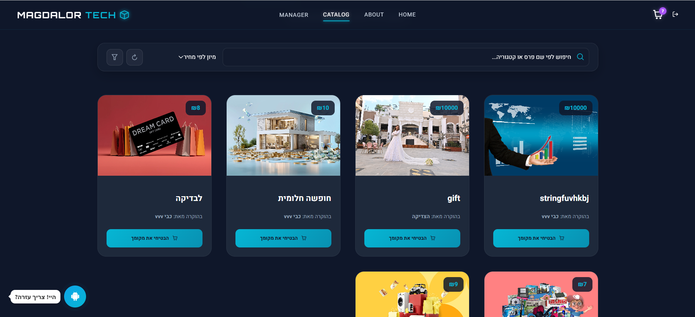
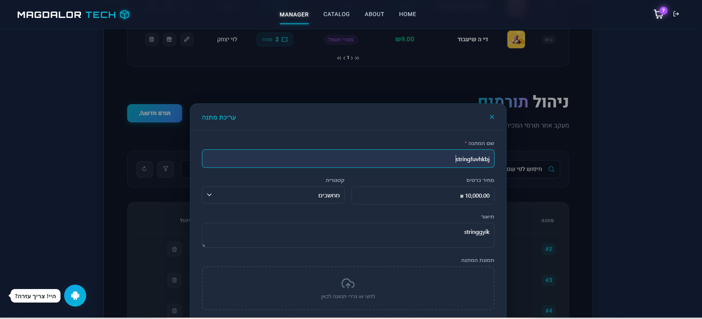

#  Magdalor Tech - Chinese Auction System
### פלטפורמה מתקדמת מקצה לקצה (Full-Stack) לניהול מערכות מכירה והגרלות

מערכת **Magdalor Tech** היא פתרון תוכנה מקיף המשלב עוצמה של צד שרת ב-.NET 8 עם ממשק משתמש (UI) מרהיב ב-Angular. המערכת עוצבה כדי לספק חווית משתמש חלקה ויוקרתית, לצד כלי ניהול ואנליטיקה מתקדמים למנהלי המערכת.

---

##  מבט אל המערכת (Visual Showcase)

**דף הבית והתחברות** | **נציגה וירטואלית מבוססת AI**
:---:|:---:
 | 
*ממשק כניסה מעוצב עם ספירה לאחור* | *אלישבע - עוזרת אישית המלווה את המשתמש*

**קטלוג פרסים יוקרתי** | **לוח בקרה למנהל (Analytics)**
:---:|:---:
 | 
*סינון ומיון מתקדם של פרסים* | *ניתוח הכנסות והתפלגויות בזמן אמת*

**ניהול ועריכת תוכן (Admin Panel)**
:---:

*ממשק CRUD מלא ונוח לניהול המערכת*

---

## תכונות ליבה (Core Features)

###  חווית משתמש (Frontend)
* **נציגה וירטואלית "אלישבע":** צ'אט-בוט חכם המוטמע במערכת למתן עזרה ושירות לקוחות אינטראקטיבי.
* **מערכת הזמנות דינמית:** ניהול עגלת קניות בזמן אמת עם חישובים אוטומטיים.
* **UI/UX מודרני:** עיצוב Dark Mode, רספונסיביות מלאה ואנימציות חלקות לחוויית משתמש מקסימלית.

###  מנוע צד שרת (Backend)
* **מנוע הגרלות:** מנגנון אוטומטי המבצע הגרלות מדויקות לכל מתנה בנפרד.
* **אבטחה מתקדמת:** אימות והרשאות משתמשים באמצעות טוקנים (JWT) והגבלת קצב בקשות (Rate Limiting).
* **אוטומציית אימיילים:** שליחת הודעות אוטומטיות לזוכים המאושרים באמצעות שירותי SMTP.
* **דוחות ונתונים:** ייצוא קל ומהיר של נתוני הזוכים והכנסות המערכת לקבצי CSV.

---

## ארכיטקטורה וטכנולוגיות

### Backend (API)
* **Framework:** ASP.NET Core (.NET 8) / C# 12
* **Database Management:** Entity Framework Core
* **Mapping & Logging:** AutoMapper, Serilog

### Frontend (Client)
* **Framework:** Angular 20
* **Language:** TypeScript
* **Styling:** Sass (SCSS)

---

## התקנה והרצה (Quick Start)

**1. שיבוט הפרויקט (Clone):**
`git clone https://github.com/elisheva-666/chinese-auction-system.git`

**2. הגדרת צד שרת (API):**
* נווט לתיקיית `final-final-api`.
* עדכן את ה-`ConnectionString` ב-`appsettings.json`.
* הרץ את הפקודה: `dotnet run`.

**3. הגדרת צד לקוח (Angular):**
* נווט לתיקיית `chinese-auction-web`.
* התקן תלותים באמצעות: `npm install`.
* הרץ את הפרויקט: `ng serve`.

---

